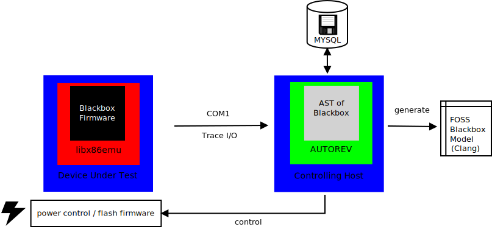

# AUTOREV

A framework for automated firmware reverse engineering using blackbox testing.
After bringing the DUT in a defined state (powered-on, powered-off, restart) a
serial connection is used to trace MMIO between firmware and the hardware.
The AUTOREV framework will generate an AST and do additional tests to restore
the high level programm that runs on this specific hardware (CPU, DRAM, Chipset,
PCI devices, SuperIO, USB, SATA, PCIe ...).

That means the firmware must be patched in order to:
* contain a serial driver
* contain libx86emu to trace MMIO
* contain a shell to allow runtime configuration of BIOS options

An example can be found here: [coreboot patch 32020](https://review.coreboot.org/c/coreboot/+/32020)

**Note:** This framework can only generate code for a limited scope. It will never create an identical programm (compared the the programm that is being traced) as that would require too many tests on different hardware setups.

## Documentation

Extensive documentation can be found in the [Documentation](Documentation/Readme.md) folder.
## Usage

The program basically consists of three different steps. Generating, Tracing,
Analyzing. When we have a fresh installation, we need to go through all the
following steps:

0. Adjust the config.yml

The config.yml contains all user-specific configuration data. The _start-_ and
_stopsignal_ can be signals coming from the DUT indicate when to start or stop the
recording of the trace. This is to minimize the scope of the recorded trace.

_serial_ defines which serial we use. It can either be a file used for exchanging
date like in the QEMU example, or a (virtual) serial port. Here you can also
define the baudrate and timeouts.

_dutcontrol_ is used to, Suprise, control the dut. There are four types of
scripts used: initcmd, startcmd, stopcmd and restartcmd. You can link shell
scripts here. Use the QEMU example for reference.

_options_default_table_ defines which device or default config should be used
for generating and running testcases. This should match the default config you
add in Step 1.

_variable_ options defines the bios configuration options we want to alter. The
default configuration blob can contain much more configuration options, those
are the only one we iterate over. The options need a name, a byte offset where
they are located *within* the default bios configuration file. AUTOREV will
patch the binary configuration file during runtime. Therefore also the size
(bitwidth) is needed. To generate tests accordingly, AUTOREV needs to know what
is the possible min value the configuration can be, and what is the maximum
value it can contain, namely _min_ and _max_ in the config.yml

Databsae configuration can be made within the _database_ section and should be
self explanatory.

1. Add a new default configuration

The client side will/has to accep a configuration. Within AUTOREV we patch the
_binary_ configuration with the offsets and possible values defined in the
config.yml file.

2. Generate possible traces

Within the config.yml we do five a range of possible values a bios configuration
can accept. AUTOREV generates test cases out of these possible values.

3. Run the testcases and record traces

AUTOREV now runs the testcases one-by-one and records all IO traces. The IO
traces will be saved in the MySQL DB. For more information check [Database
Documentation](Documentation/database.md).

4. Generate an Abstract Syntax Tree (AST)

After recording the traces and dumping them into the database, we can generate
an Abstract Syntrax Tree out of it. The AST is a abstract representation of the
code flow. Each node equals one instruction and can have multiple connections to
other nodes (instructions) with various conditions. We can either represent the
AST in a .dot file or generate code out of it.

5. Replace BLOB with generated .c file

If AUTOREV was successful, you can replace the BLOB with the generated .c file.
There is no guarantee that this actually works. Also features like Polling,
Loop-detection, functions, etc. are still missing.

The steps 1. to 4. will be explained in more detail below.

### Prerequesitions

* Mysql DB (mariadb, mysqldb, etc.)
* QEMU (for testing)
* golang

### Installation

To install the package, fetch it via go with
> go get github.com/9elements/autorev

This will automatically clone the repository into your $GO/src directory. Go to $GO/src/github.com/9elements/autorev and write
>go build
to build a executable binary file.

### Set up database

You need to have mysql installed an running. First create database with
> CREATE DATABASE autorev

Next you need to create the tables with
> mysql -uroot -p autorev < autorev_withData.sql

This generates all required tables.

### Add new Default Configuration to the Database

In order to generate test-cases, you need to execute
> ./autorev -newConfig -newConfigFile qemu_test/qemuTestDefaults.bin -newConfigName qemuConfig

The `-newConfig` flag indicates that we are generating a new default config.
Default configs are needed for generating new test sets. AUTOREV patches the
default config with the current option to test. `-newConfigFile` takes the
default configuration blob as input. `newConfigName` provides a default name for
the configuration e.g. the platform name.

### Generate Testcases for all bios configuration options

Now we need to generate various test cases for all possible bios configuration
options.

> ./autorev -newtrace

generates test cases for all possible bios configuration options specified in
the config.yml file. If the e.g. BiosOption1 can be set to values between 0 and
10, AUTOREV generates 11 different test caes for all possible values between 0
and 10. Of course, if we use more options, these options will be concatenated
with each other - which increases the amount of test cases exponentially.
Afterwards, AUTOREV outputs the amount of generated test cases.

### Run all Testcases and Collect Data

Now that we have all test cases in place, we need to run the complete set with

> ./autorev -collecttraces

Depending on the amount of generated traces, this might take a while.

### Generate AST and SVG Tree

Noe we have run all traces with all possible bios configurations options we want
to test. Next, we need to generate a Abstract Syntax Tree (AST) from the
generated traces. If we run

> ./autorev -buildast -genDot sampleTree.dot -genCCode sampleC.c

AUTOREV fetches the traces from the databsae, generates an AST from those, and
converts the AST into useable C code.
We save this AST in a .dot file which can be converted to a SVG file with

> dot -Tsvg sampleTree.dot -O

This will genrate a sampleTree.dot.svg file which can be viewed with e.g.
ImageViewer.

## Principle

The analysis of a binary file can basically be divided into two parts - the first part is the data gathering, the second part consists of the dynamical analysis. Even though within the dynamical analysis we _might_ need to generate more test data - the initial data collection can take quite some time, depending on the options which need to be tested, the runtime of the binary and the complexity.

### Data Collection

For collecting data, we first need to set up the target accordingly. The target needs to be configured such that it outputs test data as described in protocol.md.
